# Інструкція для студентів
## Як здавати домашні завдання

---

## Зміст

- [Інструкція для студентів](#інструкція-для-студентів)
	- [Як здавати домашні завдання](#як-здавати-домашні-завдання)
	- [Зміст](#зміст)
	- [1. Що таке Node.js і навіщо він потрібен](#1-що-таке-nodejs-і-навіщо-він-потрібен)
	- [2. Що таке Git](#2-що-таке-git)
	- [3. Встановлення Node.js](#3-встановлення-nodejs)
		- [Windows](#windows)
		- [macOS](#macos)
	- [4. Встановлення Git](#4-встановлення-git)
		- [Windows](#windows-1)
		- [macOS](#macos-1)
	- [5. Реєстрація на GitHub. У вас він вже встановлений, тому можете пропускати цей пункт.](#5-реєстрація-на-github-у-вас-він-вже-встановлений-тому-можете-пропускати-цей-пункт)
	- [6. Як зробити форк репозиторію](#6-як-зробити-форк-репозиторію)
	- [7. Як клонувати репозиторій на свій комп'ютер](#7-як-клонувати-репозиторій-на-свій-компютер)
	- [8. Як виконати домашнє завдання](#8-як-виконати-домашнє-завдання)
	- [9. Як здати домашнє завдання](#9-як-здати-домашнє-завдання)
	- [10. Як перевірити результат](#10-як-перевірити-результат)
	- [Часті запитання](#часті-запитання)

---

## 1. Що таке Node.js і навіщо він потрібен

**Node.js** - це програма, що дозволяє запускати JavaScript на вашому комп'ютері, а не тільки в браузері. Зазвичай JavaScript працює лише в браузері. Node.js дає можливість запускати JS-код прямо в терміналі локально на вашому комп'ютері.

---

## 2. Що таке Git

**Git** - це програма для збереження історії змін у коді. Ви можете зберігати версії свого коду і повертатись до будь-якої з них.

**GitHub** ж - це сайт де зберігаються проєкти, які використовують Git. Це як Google Drive, але для коду.

Нам Git потрібен щоб:
- завантажити завдання собі на комп'ютер
- відправити виконану роботу на перевірку

> Коротко: Git = система збереження версій коду. GitHub = хмарне сховище для Git-проєктів.

---

## 3. Встановлення Node.js

### Windows

1. Відкрийте браузер і перейдіть на сайт [nodejs.org/download](https://nodejs.org/download)

2. Вгорі сторінки є рядок налаштувань. Переконайтесь що вибрано:
	- версія з позначкою **LTS** (стабільна, рекомендована)
	- система **Windows**

3. Трохи нижче побачите дві зелені кнопки. Натисніть ліву - **Windows Installer (.msi)**

4. Завантажиться файл з назвою типу `node-v24.16.0-x64.msi`. Запустіть його

5. У вікні встановлення натискайте **Next** → **Next** → **Install** → **Finish**. Нічого не міняйте, всі налаштування за замовченням підходять

6. Після встановлення **перезапустіть комп'ютер**

**Перевірка:** Відкрийте термінал (натисніть `Win + R`, введіть `cmd`, натисніть Enter) і введіть:
```
node --version
```
Якщо побачите щось типу `v24.16.0` - все встановлено правильно ✓

### macOS

1. Перейдіть на [nodejs.org/download](https://nodejs.org/download)

2. У рядку налаштувань виберіть версію з позначкою **LTS** і систему **macOS**

3. Натисніть кнопку **macOS Installer (.pkg)**

4. Завантажиться файл `.pkg`. Запустіть його і натискайте **Continue** → **Continue** → **Install**

5. Після встановлення відкрийте **Terminal** (через Spotlight: `Cmd + Space`, наберіть "Terminal")

**Перевірка:**
```
node --version
```
Якщо побачите щось типу `v24.16.0` - все встановлено правильно ✓

---

## 4. Встановлення Git

### Windows

1. Перейдіть на [git-scm.com/download/win](https://git-scm.com/download/win)
2. Натисніть на посилання `Click here to download` на сторінці 
3. Запустіть завантажений файл (назва типу `Git-2.54.0-64-bit.exe`)
4. Натискайте **Next** на кожному кроці, всі налаштування за замовченням підходять. Єдиний момент - на кроці **"Choosing the default editor"** можете одразу вибрати **"Use Visual Studio Code"**.
5. Натисніть **Install** → **Finish**

**Перевірка:** Відкрийте новий термінал (`cmd`) і введіть:
```
git --version
```
Якщо побачите щось типу `git version 2.54.0` - все встановлено правильно ✓

### macOS

На macOS Git зазвичай вже встановлений. Відкрийте Terminal і введіть:
```
git --version
```
Якщо вискочить вікно з пропозицією встановити Developer Tools - погоджуйтесь, воно встановить Git автоматично.

---

## 5. Реєстрація на GitHub. У вас він вже встановлений, тому можете пропускати цей пункт.

1. Перейдіть на [github.com](https://github.com)
2. Натисніть **Sign up** у правому верхньому куті
3. Введи свій email, придумайте пароль і username.
4. Підтвердіть email - на пошту прийде лист з кодом
5. Готово -ваш акаунт створено

---

## 6. Як зробити форк репозиторію

**Форк** - це копія чужого репозиторію у ваш акаунт. Ви отримаєте свою особисту копію завдання, в яку можете вносити зміни.

1. Отримайте від викладача посилання на репозиторій з домашнім завданням. Воно виглядає приблизно так:
	```
	https://github.com/PliutaNastya/hw-lesson-1
	```

2. Перейдіть за цим посиланням у браузері

3. У правому верхньому куті сторінки знайдіть кнопку **Fork** і натисніть на неї
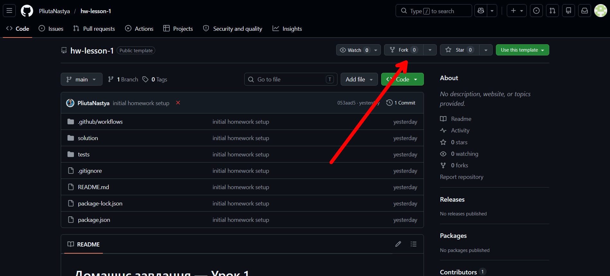

4. Відкриється сторінка "Create a new fork". Нічого не змінюйте, просто натисніть зелену кнопку **Create fork**
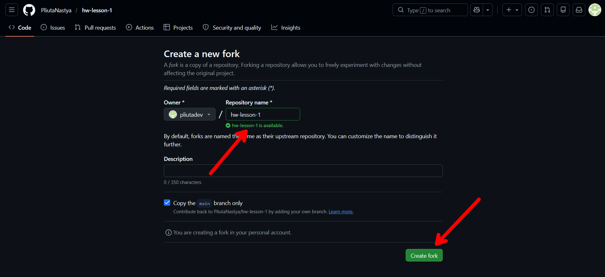

5. GitHub перенаправить вас на вашу копію репозиторію. Адреса зміниться на:
	```
	https://github.com/ТВІЙ-USERNAME/hw-lesson-1
	```
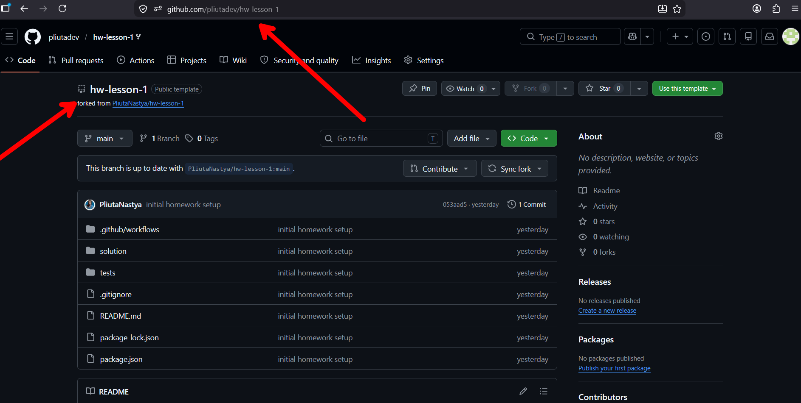

Форк зроблено ✓

---

## 7. Як клонувати репозиторій на свій комп'ютер

**Клонування**  - це завантаження репозиторію з GitHub на ваш комп'ютер.

1. Перейдіть на сторінку **свого форку** (НЕ репозиторій, посилання якого надавав вчитель, А НА ТОЙ, ЩО У ВАШОМУ АКАУНТІ GitHub)

2. Натисніть зелену кнопку **Code**

3. Переконайтесь що вибрано вкладку **HTTPS** і скопіюйте посилання, воно виглядає так:
	```
	https://github.com/ТВІЙ-USERNAME/hw-lesson-1.git
	```
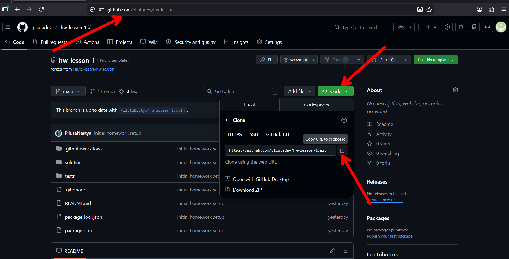

4. Відкрийте термінал:
	- **Windows:** натисніть `Win + R`, введіть `cmd`, натисніть Enter
	- **macOS:** `Cmd + Space`, наберіть "Terminal", натисніть Enter

5. Перейдіть в папку де хочете зберігати завдання. Наприклад на Робочий стіл:
	```bash
	# Windows
	cd Desktop

	# macOS
	cd ~/Desktop
	```

6. Введіть команду клонування (замість посилання вставте своє, скопійоване з гітхаб у пункті 3):
	```bash
	git clone https://github.com/ТВІЙ-USERNAME/hw-lesson-1.git
	```

7. З'явиться папка `hw-lesson-1` на Робочому столі

8. Зайдіть в неї і відкрийте у VS Code.
9. Відкрийте термінал у VS Code
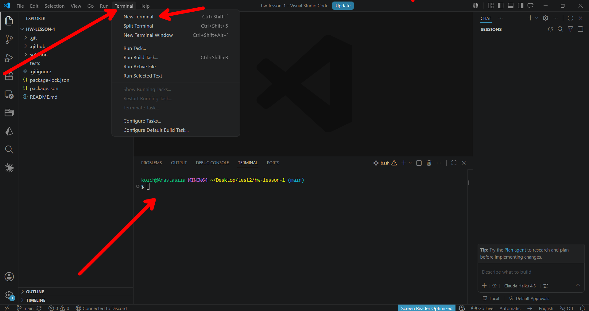

10. Встановіть залежності (потрібно зробити **один раз**):
	В цьому відкритому терміналі введіть команду
	```bash
	npm install
	```
	Ця команда завантажить інструменти для перевірки вашої роботи. Зачекайте поки завершиться.

Готово. У вас з'явилась додаткова папка node_modules. Щоб не злякатись - в неї можете не лізти. ✓
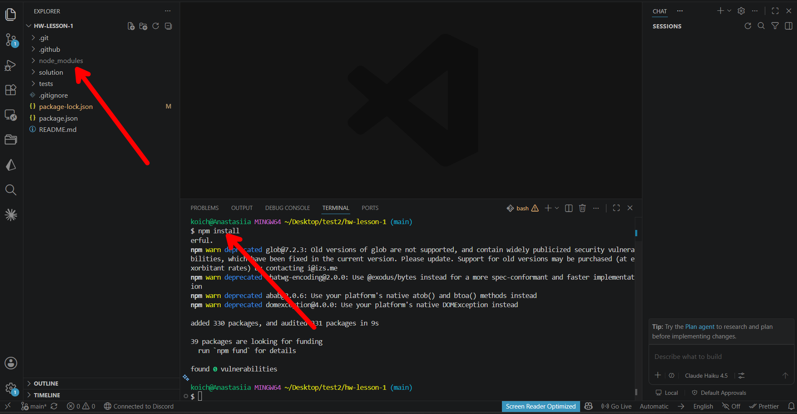

---

## 8. Як виконати домашнє завдання

1. У VS Code в папці `hw-lesson-1` знайдіть файл `solution/solution.js` - **тільки цей файл і потрібно редагувати**:
 
2. Відкрийте його і пишіть свій код там де написано `// ваш код тут`
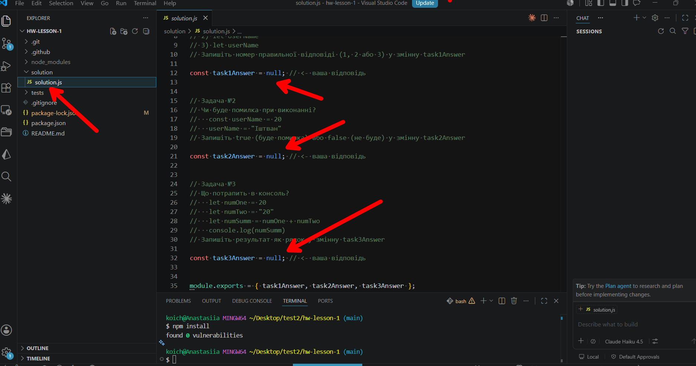

3. Щоб перевірити чи правильно виконали завдання - запустіть тести в терміналі:
	```bash
	npm test
	```
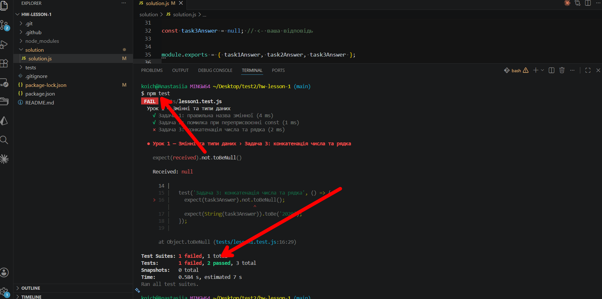

4. Ви побачите результат. Наприклад:
	```
	✓ Задача 1: правильна назва змінної
	✓ Задача 2: помилка при переприсвоєнні const
	✗ Задача 3: конкатенація числа та рядка
	  Expected: "2020"
	  Received: null
	```
	Знак **✓** - задача виконана правильно.
	Знак **✗** - є помилка, читайте підказку нижче.

5. Виправляйте і запускайте `npm test` знову поки всі тести не стануть ✓

---

## 9. Як здати домашнє завдання

Коли виконали завдання і всі тести проходять - відправляйте роботу на GitHub. Для цього потрібно ввести три команди в терміналі.

1. ### Крок 1 — Переконайтесь що знаходитесь саме в папці з завданням (термінал має показувати шлях до `hw-lesson-1`):
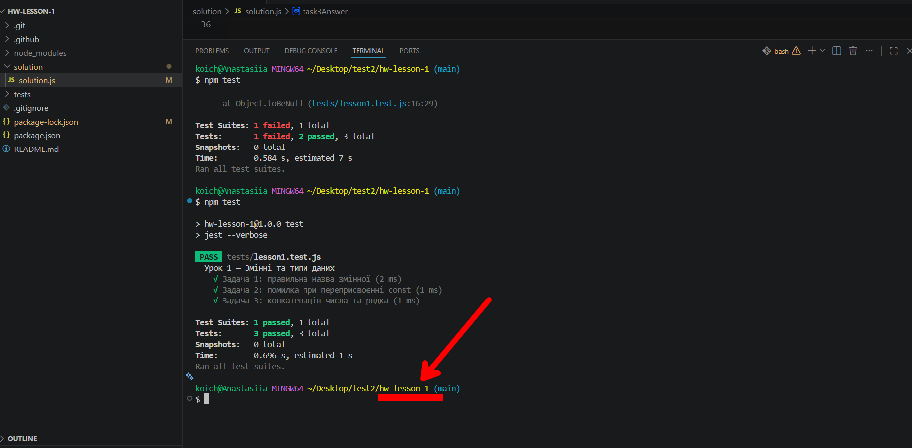

2. ### Крок 2 — позначити всі змінені файли для збереження
`git add .`
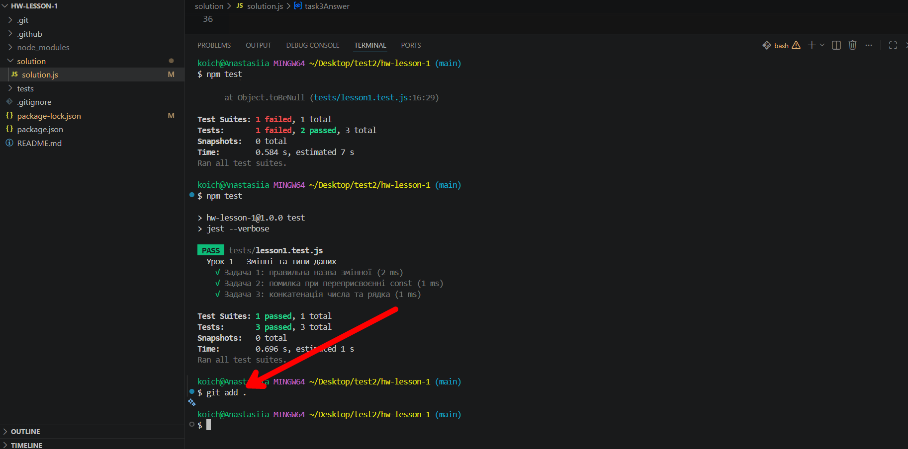

3. ### Крок 3 — зберегти зміни з коротким описом
`git commit -m "add: lesson 1"`
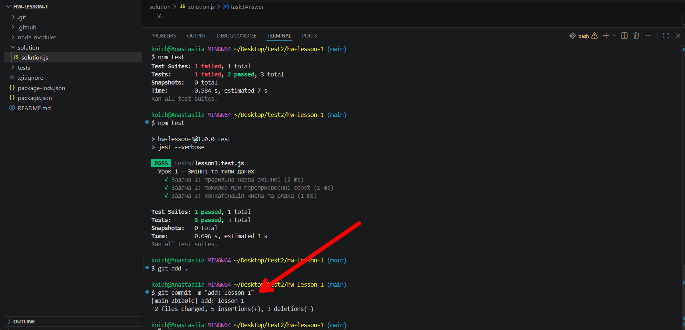

4. ### Крок 4 — відправити на GitHub
git push
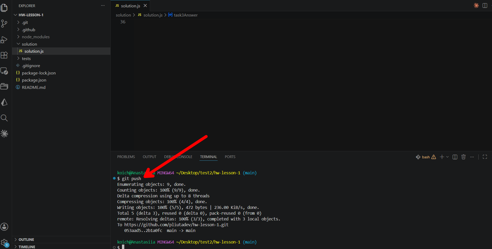

Після цих трьох команд ваша робота відправлена ✓

> Якщо при `git push` питає логін і пароль - введіть свої дані від GitHub.

---

## 10. Як перевірити результат

Після `git push` GitHub автоматично запускає перевірку вашого коду.

1. Зайдіть на сторінку свого репозиторію на GitHub:
	```
	https://github.com/ТВІЙ-USERNAME/hw-lesson-1
	```

2. Натисніть на вкладку **Actions** (вона між "Pull requests" і "Projects")

3. Ви побачите список запусків. Найновіший буде зверху. Зачекайте 1-2 хвилини поки він завершиться

4. Результат:
	- 🟢 Зелена галочка означає, що всі тести пройшли, робота зарахована ✓
	- 🔴 Червоний хрестик означає, що є помилки, натисніть на запуск щоб побачити деталі
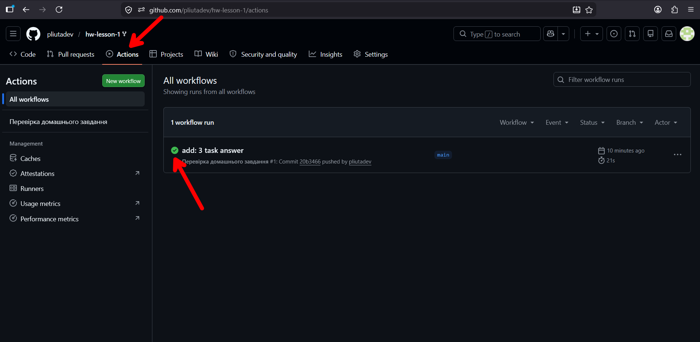

5. Якщо є помилки - натисніть на назву запуску → **test** → розгорніть розділ **Run npm test** і побачите які саме тести не пройшли

---

## Часті запитання

**Питання: Термінал пише `git is not recognized`**
Відповідь: Git не встановлений або потрібно перезапустити термінал після встановлення. Закрийте термінал, відкрийте новий і спробуйте знову.

**Питання: Термінал пише `npm is not recognized`**
Відповідь: Node.js не встановлений або потрібно перезапустити комп'ютер після встановлення.

**Питання: Я випадково змінив файл тестів, що робити?**
Відповідь: Введіть в терміналі:
```bash
git checkout tests/
```
Це поверне файли тестів до початкового стану.
